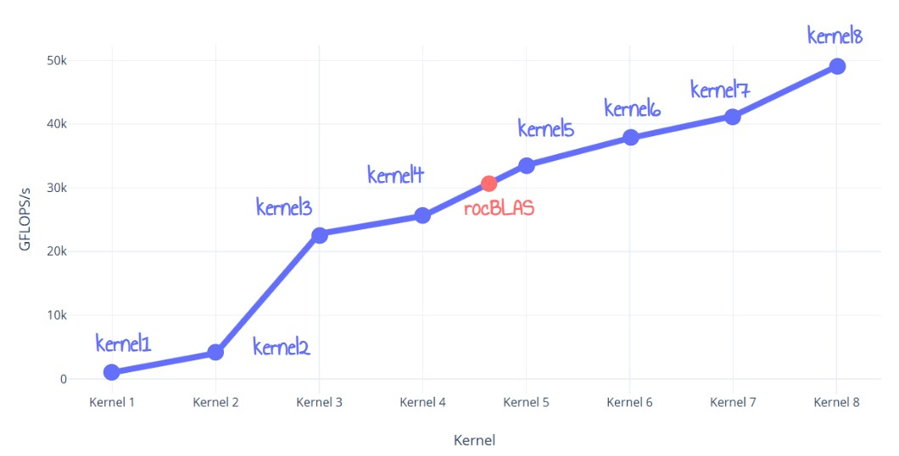

# Fast FP32 Matrix Multiplication on RDNA3 GPUs

This repository contains the code used in an in-depth exploration of Fast FP32 Matrix Multiplication on RDNA3 GPUs. The analysis highlights optimization techniques and performance improvements tailored to RDNA3 architectures. For detailed insights, refer to the full deep dive here: [Optimizing Matrix Multiplication on RDNA3: 50 TFlops and 60% Faster Than rocBLAS](https://seb-v.github.io/optimization/update/2025/01/20/Fast-GPU-Matrix-multiplication.html)

The current best implementation reaches **50 TFLops** on a 7900 XTX and **outperforms rocBLAS by 60%**

| Kernel # | Description                       | Time (ms) | Performance (GFLOPS) | Relative Performance to rocBLAS |
|----------|-----------------------------------|-----------|-----------------------|--------------------------|
| Kernel 0 | rocBLAS                           | 4.4992    | 30547.4              | 100.0 %                   |
| Kernel 1 | Naive version                     | 136.006   | 1010.54              | 3.3 %                     |
| Kernel 2 | LDS tiling                        | 34.2059   | 4017.99              | 13.1 %                    |
| Kernel 3 | Register tiling                   | 6.0341    | 22777.0              | 74.6 %                    |
| Kernel 4 | GMEM Double buffer                | 5.3772    | 25559.6              | 83.7 %                    |
| Kernel 5 | LDS Utilization Optimization      | 4.0994    | 33526.6              | 109.8 %                   |
| Kernel 6 | ISA VALU optimizations            | 3.6368    | 37791.2              | 123.7 %                   |
| Kernel 7 | Unroll inner loop                 | 3.3314    | 41255.6              | 135.1 %                   |
| Kernel 8 | GMEM loads                        | 2.8032    | 49047.3  | 160.6% |

> The results for Kernel 0 were obtained using rocBLAS delivered with AMD HIP SDK for Windows (ROCm 6.2.1)

> Kernels 0 through 5 are implemented in C++ HIP.

> Kernels 6 and 7 involve direct modifications to the [AMD ISA](https://www.amd.com/content/dam/amd/en/documents/radeon-tech-docs/instruction-set-architectures/rdna3-shader-instruction-set-architecture-feb-2023_0.pdf)

### Building the project

1. Install the [AMD HIP SDK for Windows](https://www.amd.com/en/developer/resources/rocm-hub/hip-sdk.html)

2. Run the script `./build.sh`

### Quick Details About the Kernels

- **Kernel 1: Naive**
  - Straightforward implementation with direct use of global memory.

- **Kernel 2: LDS Tiling**
  - The matrix multiplication is split into smaller submatrices.
  - Data is loaded into the LDS (Local Data Share) for local multiplication.

- **Kernel 3: Two-Level Tiling (LDS and Registers)**
  - Widespread two-level tiling implementation using LDS and register tiles.
  - Better latency hiding because of increased arithmetic complexity.
  - Use of ds_load_128b instruction for LDS loading

- **Kernel 4: Global Memory Double Buffering**
  - Implements double buffering for global memory loads to the LDS.

- **Kernel 5: LDS Usage Optimization**
  - Removes LDS bank conflicts
  - Switches from default WGP mode to CU mode for better performance.
  - Increase WaveFront Tile size to 16x8 instead of 8x8 to reduce pressure on LDS

- **Kernel 6: ISA-Level Optimization**
  - Uses dual-issue FMA instructions only in inner loop (`v_dual_fmac_f32`).
  - Redistributes VGPR banks to avoid register bank conflicts.

- **Kernel 7: Inner Loop Unrolling**
  - Fully unrolls the inner loop.
  - Sets higher wavefront priority for VALU operations compared to LDS operations.

- **Kernel 8: Batched GMEM reads**
  - Reduced number of instructions needed to do global_loads by using SPGR addressing
  - Precompute loads offset in SGPR memory and batched loads

